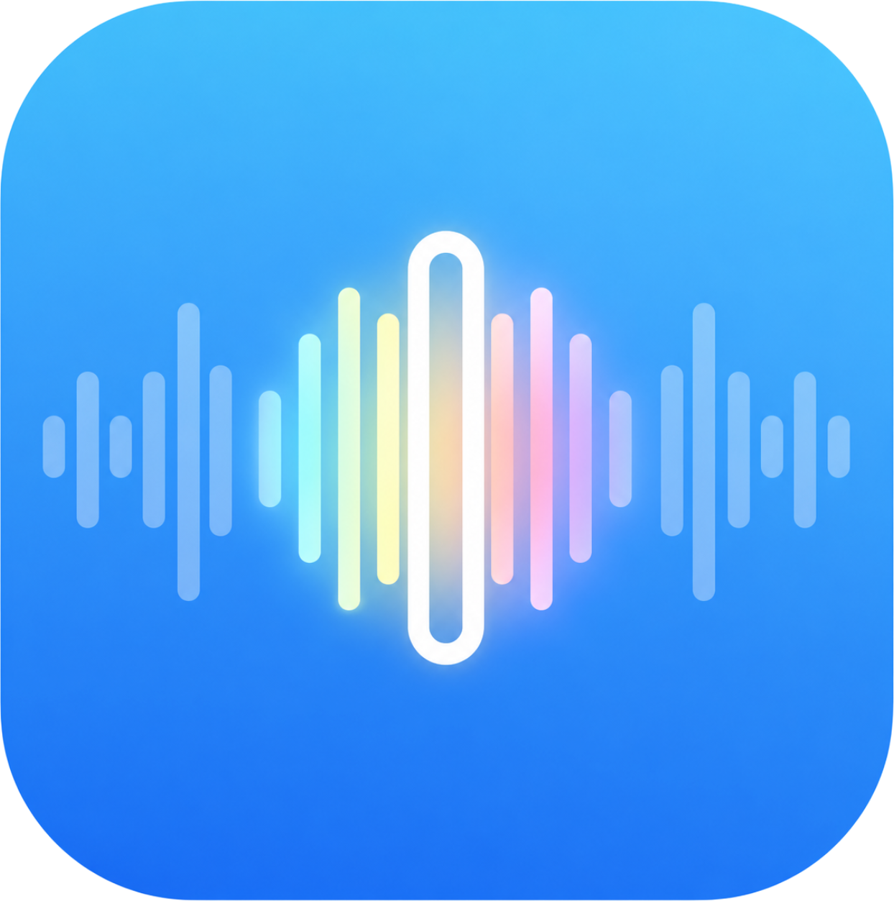
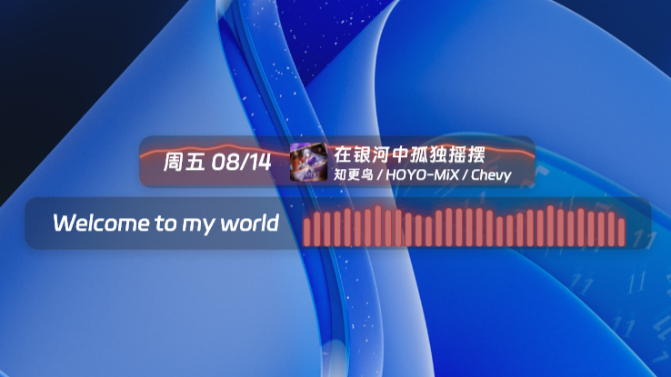

# 律动岛 · RhythmIsland

律动岛是面向 ClassIsland 2.x 的实时音乐频谱项目：插件负责捕获默认扬声器的实时声音并显示频谱，配套主题可以把频谱放到 ClassIsland 主要行背景中。

> 当前版本：`1.0.0.0 公开测试版`

## 快速开始

### 安装插件

从 [GitHub Releases](https://github.com/sky-shunfengjun/RhythmIsland/releases) 下载 `RhythmIsland.cipx`，在 ClassIsland 的插件设置中选择本地安装。

安装后重启 ClassIsland，在“设置 → 插件 → 律动岛”中主动打开声音捕获，然后在编辑模式中添加“律动岛频谱”组件。

### 安装配套背景主题

背景主题是可选的独立安装包。使用主题时：

1. 先安装并启用律动岛插件。
2. 从 [GitHub Releases](https://github.com/sky-shunfengjun/RhythmIsland/releases) 下载 `RhythmIsland.Theme.zip` 并安装。
3. 将主题放在 Fluent 或 Classic 之后加载。
4. 在律动岛设置页打开“背景频谱”。

主题不能替代插件，也不会自动打开声音捕获。

## 功能亮点

- 提供柱状频谱、平滑线条和曲线填充三种显示样式。
- 支持底部向上、上下镜像和中心镜像，中心镜像默认将低频放在中间。
- 颜色可以跟随 ClassIsland 主题色、使用 Windows 当前媒体封面（SMTC）取色，或使用自选颜色。
- 支持鲜艳、柔和和偏色三种封面配色模式。
- 支持静态渐变、动态渐变和发光效果。
- 每个频谱组件都可以独立调整细节数量、幅度、长度、透明度、刷新率和无声自动收起。
- 提供独立的配套背景主题，普通频谱组件和背景频谱共享同一套捕获与分析服务。

## 兼容范围

- Windows 10/11 x64
- ClassIsland 2.1.0.1

## 当前限制

这是公开测试版。Fluent 和 Classic 是主要兼容目标，第三方主题、不同显示器之间切换、长期运行和较早 Windows 10 的 SMTC 降级路径仍建议继续反馈验证。

## 第三方依赖与致谢

运行时直接依赖：

- [ClassIsland.PluginSdk 2.1.0.1](https://www.nuget.org/packages/ClassIsland.PluginSdk/2.1.0.1)：提供 ClassIsland 插件、组件和设置页接口；项目宿主为 [ClassIsland](https://github.com/ClassIsland/ClassIsland)。
- [NAudio 2.3.0](https://www.nuget.org/packages/NAudio/2.3.0)：用于 Windows 默认扬声器的 WASAPI 回环捕获；源码位于 [NAudio/NAudio](https://github.com/naudio/NAudio)。

界面和系统能力：

- [Avalonia](https://github.com/AvaloniaUI/Avalonia)：由 ClassIsland 提供的界面和绘制运行环境。
- [Windows SMTC](https://learn.microsoft.com/en-us/uwp/api/windows.media.control.globalsystemmediatransportcontrolssessionmanager)：Windows 系统媒体会话接口，用于读取当前媒体封面。

测试使用 [xUnit](https://github.com/xunit/xunit) 和 [Avalonia Headless](https://github.com/AvaloniaUI/Avalonia) 进行自动化与离屏渲染验证。

仓库首页效果图中的歌曲信息和封面来自 [MediaIsland](https://github.com/bywhite0/MediaIsland)，歌词来自 [ExtraIsland](https://github.com/LiPolymer/ExtraIsland)。这两个插件不是律动岛的运行依赖。

本项目在需求、代码、测试和文档编写过程中使用了 AI 工具辅助，最终内容由项目作者审阅、修改和验证。

## 相关链接

- [插件使用说明](src/RhythmIsland.Plugin/README.md)
- [主题使用说明](src/RhythmIsland.Theme/README.md)
- [GitHub Releases](https://github.com/sky-shunfengjun/RhythmIsland/releases)
- [GPL-3.0-or-later 许可证](LICENSE)
